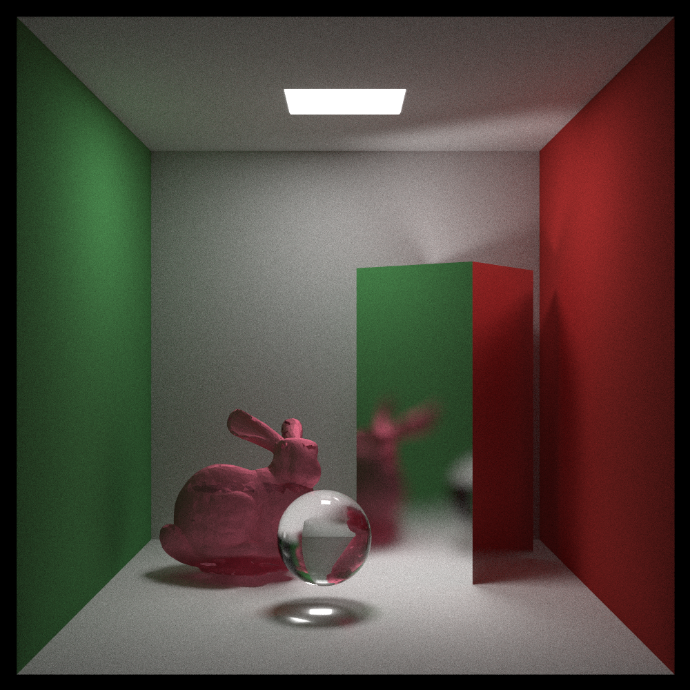

# CUDA Accelerated Ray Tracing

This project is a CUDA-based implementation of the ray tracing algorithm. It was initially inspired by the [Ray Tracing In One Weekend](https://github.com/RayTracing/raytracing.github.io) series. 
The main goal of this project was to familiarize myself with CUDA programming and its debugging ecosystem through building a ray tracer that supports OBJ mesh loading as well as a BVH acceleration structure.

I used the Ray Tracing in One weekend ray tracer architecture as a basis for the engine, later adding my own support for triangle rendering, and finally, OBJ mesh importing.
The BVH acceleration structure is constructed in parallel on the gpu as a binary tree, based on computing the Morton codes for each object in the hierarchy. I have used NVIDIA's [Thinking Parallel](https://developer.nvidia.com/blog/thinking-parallel-part-iii-tree-construction-gpu/) article series as well as their [Maximizing Parallelism in the Construction of BVHs](https://developer.nvidia.com/blog/parallelforall/wp-content/uploads/2012/11/karras2012hpg_paper.pdf) 2012 paper as references for the parallel BVH construction and traversal. 

## Main Features:

- Basic shapes rendering (Sphere, Triangle, Rectangle)
- Mesh rendering
- GPU-parallelized BVH construction
- OBJ file support for mesh loading
- Naive sphere image texture mapping
- Materials: lambertian, metal (with roughness), glass
- Depth of field 
- Jitter-based anti-aliasing

## Sample Renders

Simple Cornell Box Render (1000x1000, 3000 samples):

Stanford Bunny inside Cornell Box (1000x1000, 3000 samples):

