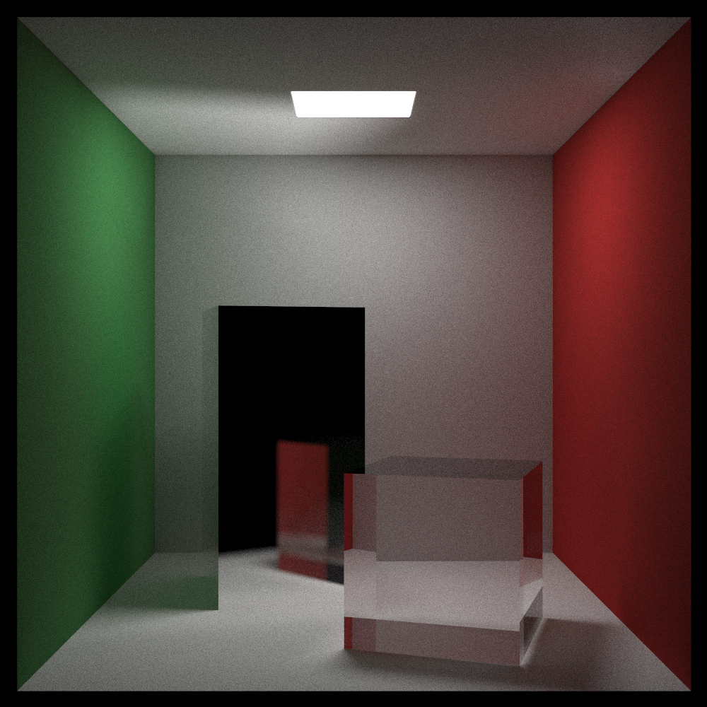

# CUDA Accelerated Ray Tracing

This project is a CUDA-based implementation of the ray tracing algorithm. It was initially inspired by the [Ray Tracing In One Weekend](https://github.com/RayTracing/raytracing.github.io) series. 
The main goal of this project was to familiarize myself with CUDA programming and its debugging ecosystem through building a ray tracer that supports OBJ mesh loading as well as a BVH acceleration structure.

I used the Ray Tracing in One Weekend CPU-based ray tracer architecture as a basis for the engine. After adapting it to run on the GPU, I went on to add support for triangle rendering, OBJ mesh importing, and finally the bounding volume hierarchy.
The BVH is constructed in parallel on the GPU as a binary tree, based on computing the Morton codes for each object in the hierarchy. I have used NVIDIA's [Thinking Parallel](https://developer.nvidia.com/blog/thinking-parallel-part-iii-tree-construction-gpu/) article series as well as their [Maximizing Parallelism in the Construction of BVHs](https://developer.nvidia.com/blog/parallelforall/wp-content/uploads/2012/11/karras2012hpg_paper.pdf) 2012 paper as references for the parallel BVH construction and traversal. I used NVIDIA's cuda-gdb and compute-sanitizer debuggers in conjunction with the NVIDIA Nsight Systems and Compute profiling tools to debug and profile the code. 

## Main Features:

- Basic shapes rendering (Sphere, Triangle, Rectangle)
- Mesh rendering
- OBJ file support for mesh loading
- GPU-parallelized BVH construction
- Naive sphere image texture mapping
- Translation and Rotation transformations
- Materials: lambertian, metal (with roughness), glass
- Depth of field 
- Jitter-based anti-aliasing

## Sample Renders
Simple Cornell Box Render (1000x1000, 3000 samples):

Stanford Bunny inside Cornell Box (1000x1000, 3000 samples):

